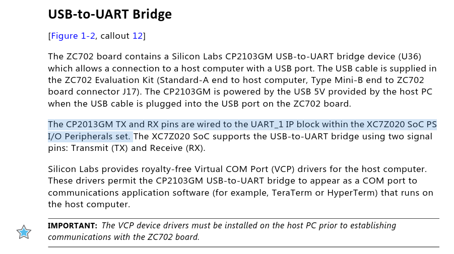

# Differences between ZC702 and PYNQ-Z2

## Objectives

This file points out some notes when using ZC702 board.

## Lab 1

1.	Select UART1 when customizing Zynq7 Processing System. It is stated in **page 34** of [ZC702 User Guide](notes/refs/ug850-zc702-eval-bd-1596187.pdf)
    

    
    

    

    <i>UART1</i>
    

2.	Block Design final result:
    

    
    

    

    <i>Block Design</i>
    
