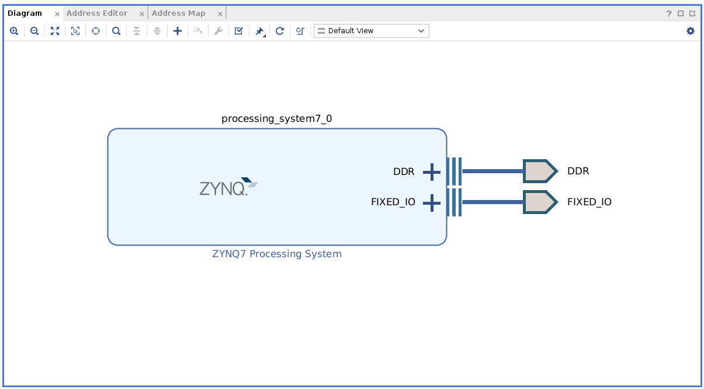
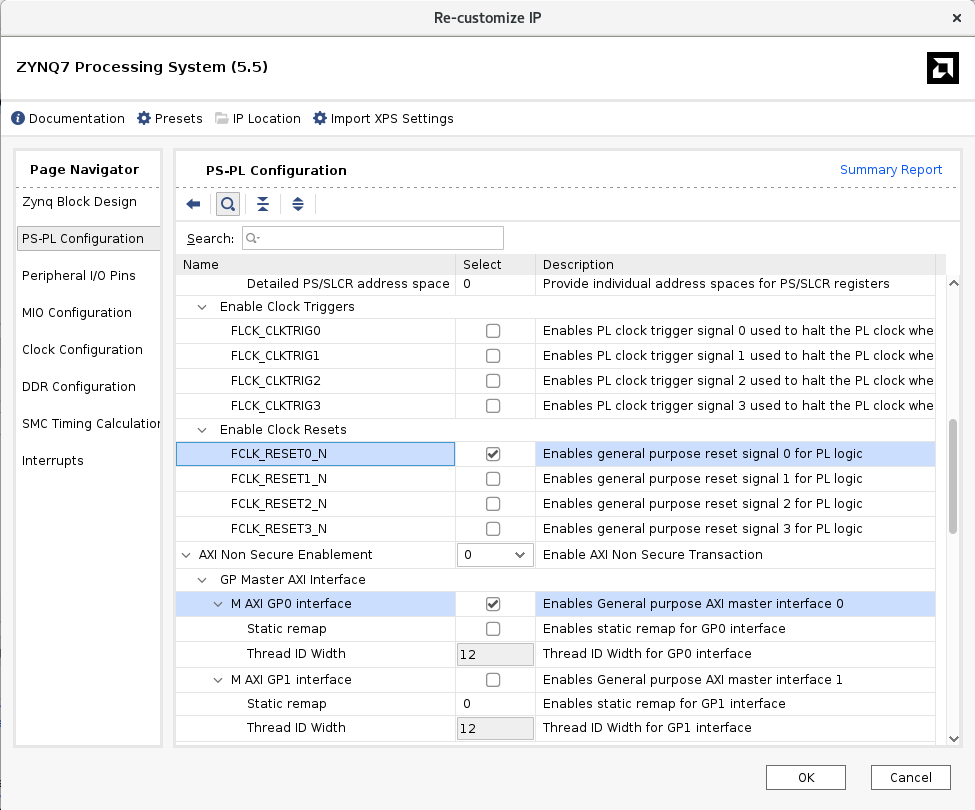
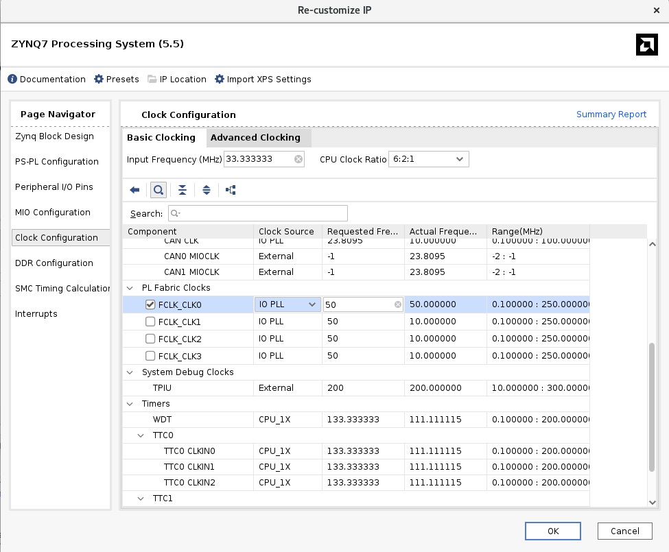
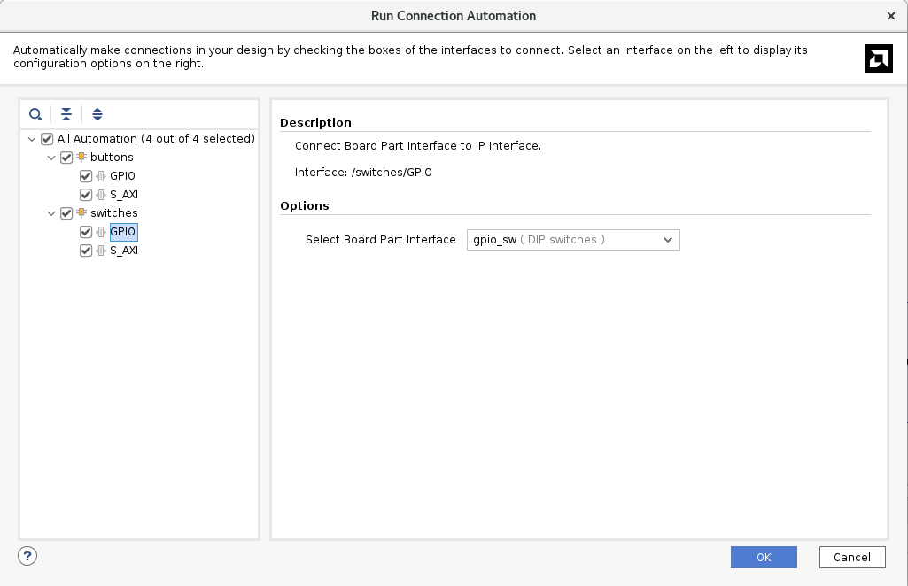
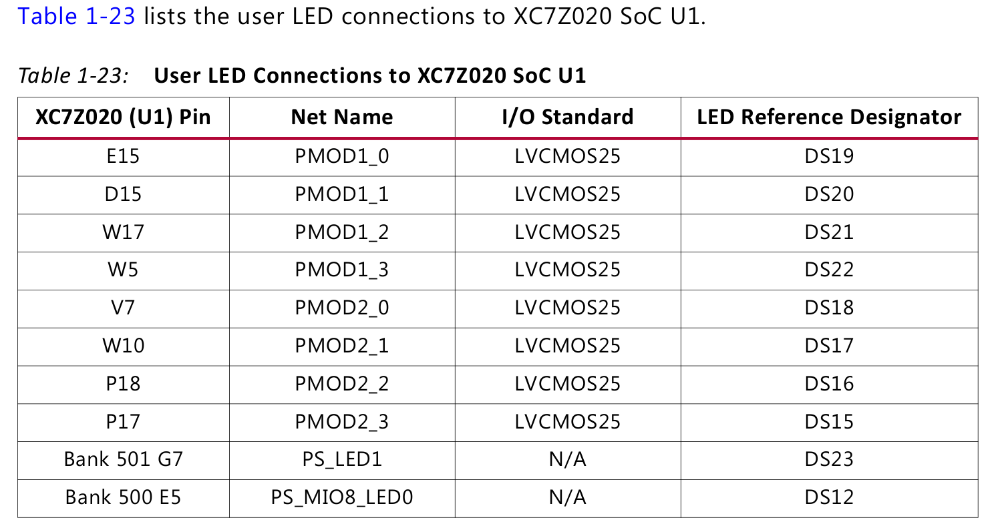
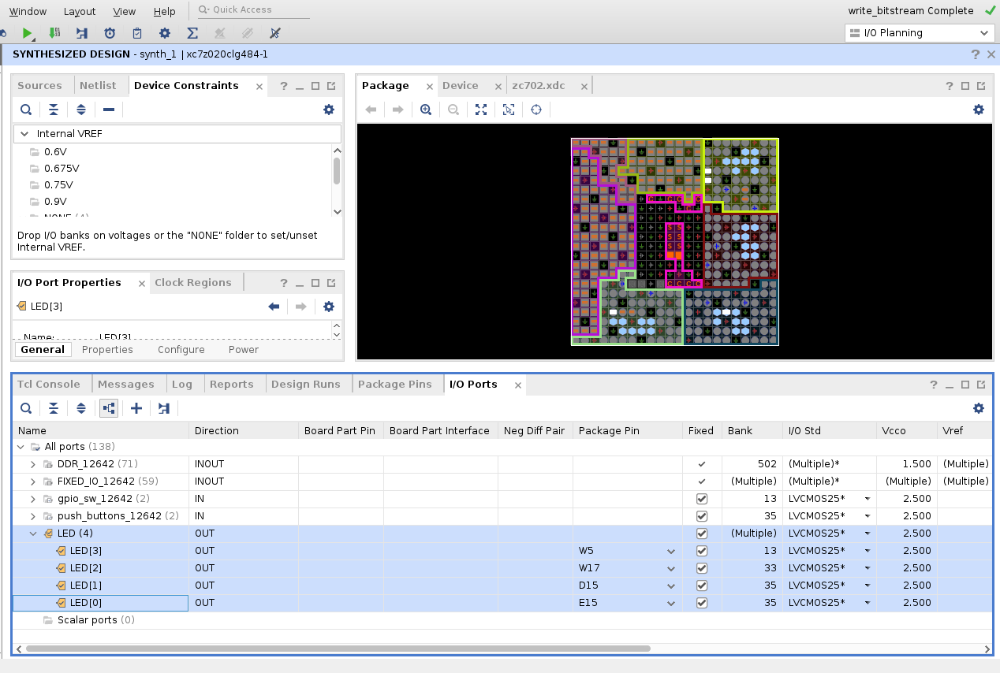

# Differences between ZC702 and PYNQ-Z2

- [Differences between ZC702 and PYNQ-Z2](#differences-between-zc702-and-pynq-z2)
  - [Objectives](#objectives)
  - [Lab 1](#lab-1)
  - [Lab 2](#lab-2)
  - [Lab 3](#lab-3)

## Objectives

This file points out some notes when using ZC702 board.

## Lab 1

1.	Select UART1 when customizing Zynq7 Processing System. It is stated in **page 34** of [ZC702 User Guide](notes/refs/ug850-zc702-eval-bd-1596187.pdf).
    

    
    

    

    <i>UART1</i>
    

2.	Block Design final result:
    

    
    

    

    <i>Block Design</i>
    

## Lab 2

1.	Select GP0 and Reset:
    

    
    

    

    <i>GP0 & Reset</i>
    

2.	Select Clock:
    

    
    

    

    <i>Clock</i>
    

3.	Select interface for buttons and switches:
    

    
    

    

    <i>Button interface</i>
    

    

    
    

    

    <i>Switch interface</i>
    

4. When running code in hardware via Vitis, if Vitis Serial Terminal does not show anything:
    - For Linux users, restart Vitis Classic under `sudo` right: `sudo vitis --classic`
    - Check if USB-to-UART cable driver has been installed

## Lab 3

1. When editting `led_ip_slave_lite_v1_0_S_AXI.v`, just copy the content of [{sources}/lab3/led_ip_slave_lite_v1_0_S_AXI.v](sources/lab3/led_ip_slave_lite_v1_0_S_AXI.v)

2. In the **Add or Create Constraints** step, select the [lab3_zc702.xdc](sources/lab3/lab3_zc702.xdc) in `{sources}/lab3` folder
   - Notice that in lab3_zc702.xdc, each ***LED pin in Block Design*** is assigned to a ***Zc702 physical package pin***. These package pins can be found in **page 47** of [ZC702 User Guide](notes/refs/ug850-zc702-eval-bd-1596187.pdf)
  
    

    
    

    

    <i>List of User LED on Zc702. You can use whatever LED you want</i>
    

    - In order to assign ***LED pin in Block Design*** to other ***Zc702 physical package pin*** (which means you will create your own `lab3_zc702.xdc` file), follow these steps:
      - Open **I/O Planning** layout as guided in Lab 2 (Lab 2, section `Make GPIO Peripheral Connections External`, step 10)
      - Expand the ***LED pin in Block Design***, then assign the ***Package Pin*** and ***IO Standard*** as stated in `ZC702 User Guide`, page 47
      - Press Ctrl+S to save it as `.xdc` file

    

    
    

    

    <i>Assign package pin and IO standard</i>
    
